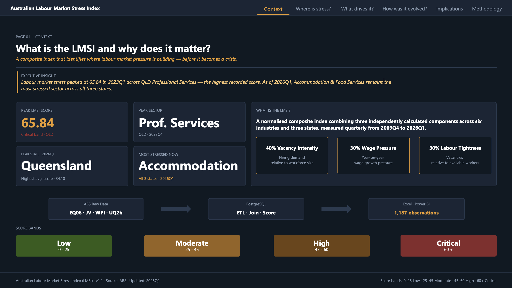

# 🇦🇺 Australian Labour Market Stress Index (LMSI)

> **An end-to-end labour market analytics project that develops a composite Labour Market Stress Index (LMSI) using Australian Bureau of Statistics (ABS) data.**

<p align="center">


</p>

---

# 📖 Table of Contents

- Project Overview
- Dashboard Preview
- Research Objectives
- Dashboard Structure
- Analytical Workflow
- Methodology
- Repository Structure
- Key Findings
- Technology Stack
- Data Sources
- Validation
- Limitations
- Future Improvements

---

# 📊 Dashboard Preview


<p align="center">

</p>

---

# 🌏 Project Overview

The **Australian Labour Market Stress Index (LMSI)** is a composite indicator designed to measure labour market stress across Australian industries and states between **2009Q4 and 2026Q1**.

Instead of relying on a single labour market metric, the LMSI integrates multiple indicators into a single framework that captures labour demand, wage pressure and labour tightness.

The project demonstrates a complete analytics workflow—from raw Australian Bureau of Statistics (ABS) datasets through data engineering, SQL modelling, dashboard development and executive reporting.

---

# 🎯 Research Objectives

The project aims to:

- Build a composite Labour Market Stress Index (LMSI)
- Compare labour market stress across industries and states
- Identify the drivers of labour market pressure
- Translate quantitative findings into policy-relevant insights
- Demonstrate an end-to-end analytics workflow suitable for consulting and economic analysis

---

# 📈 Dashboard Structure

| Page | Question Answered |
|------|-------------------|
| **01** | What is the LMSI and why does it matter? |
| **02** | Where is labour market stress highest? |
| **03** | What is driving labour market stress? |
| **04** | How has labour market stress evolved over time? |
| **05** | What are the policy implications? |
| **06** | How was the index constructed? |

---

# ⚙️ Analytical Workflow

```text
Australian Bureau of Statistics (ABS)
                │
                ▼
Python Data Transformation
                │
                ▼
PostgreSQL Data Modelling
                │
                ▼
Composite LMSI Construction
                │
                ▼
Excel Validation
                │
                ▼
Power BI Dashboard
                │
                ▼
Analytical Memo
```

---

# 🧮 Methodology

The Labour Market Stress Index combines three labour market dimensions into a weighted composite framework.

| Component | Weight | Purpose |
|-----------|-------:|---------|
| Vacancy Intensity | **40%** | Measures labour demand |
| Wage Pressure | **30%** | Measures wage growth |
| Labour Tightness | **30%** | Measures labour scarcity |

The weighting framework reflects analytical judgement informed by labour economics while maintaining transparency and interpretability.

---

# 📂 Repository Structure

```text
australian-labour-market-stress-index/

├── dashboard/
│   ├── LMSI_Dashboard.pbix
│   ├── LMSI_Dashboard.pdf
│   └── screenshots/
│
├── data/
│   ├── raw/
│   └── processed/
│
├── python/
│
├── sql/
│
├── excel/
│
├── memo/
│
├── docs/
│
├── LICENSE
└── README.md
```

---

# 📌 Key Findings

- Labour market stress has eased from its 2023 peak but remains structurally elevated.
- Wage pressure has become the dominant driver across most industries.
- Accommodation & Food Services remains Australia's highest-stress sector.
- Health Care continues to experience persistent labour shortages.
- Education & Training currently records the lowest labour market stress.

---

# 🛠 Technology Stack

| Category | Technology |
|----------|------------|
| Data Source | Australian Bureau of Statistics (ABS) |
| Data Processing | Python |
| Database | PostgreSQL |
| Query Language | SQL |
| Validation | Microsoft Excel |
| Dashboard | Power BI |
| Reporting | Analytical Memo |

---

# 📑 Data Sources

The project integrates **10 Australian Bureau of Statistics datasets** from three statistical collections:

- Job Vacancies
- Labour Force
- Wage Price Index

---

# ✅ Validation

The analytical workflow includes:

- 1,187 validated observations
- 66 quarterly periods (2009Q4–2026Q1)
- 6 industries
- 3 Australian states
- Zero duplicate records
- Standardised indicators before aggregation
- Cross-validation in Excel
- Robustness comparison across model versions

---

# ⚠️ Limitations

- Measures labour market stress rather than labour market performance.
- Some indicators rely on proxy measures.
- Weights reflect analytical judgement rather than statistical optimisation.
- One documented outlier was excluded due to an unstable denominator.
- Results support—not replace—policy judgement.

---

# 🚀 Future Improvements

Potential future enhancements include:

- Expand coverage to all Australian states and territories.
- Introduce additional labour market indicators.
- Automate the ETL workflow.
- Deploy the dashboard using Power BI Service.
- Explore alternative weighting methodologies.

---

# 👨‍💻 Author

**Umut Sarikaya**

Master of International Economics and Finance

The University of Queensland

---

## 📄 License

Released under the **MIT License**.
